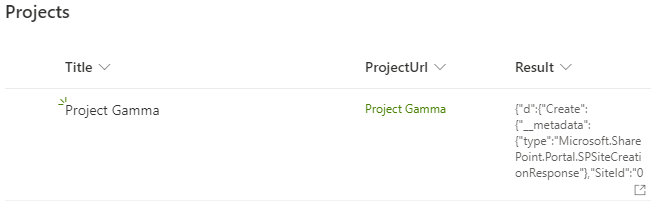
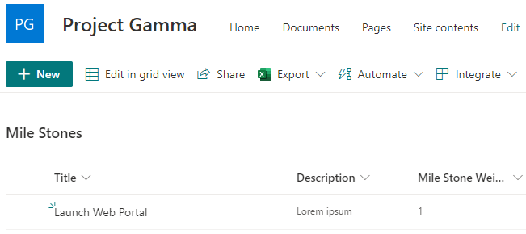

# Provisioning SharePoint Sites with Power Automate and Site Templates 

We are using Power Automate to create a site collection and site templates (previously known as site designs) to provision artifacts on that site.

The solution uses two flows, one flow to create the site and another for the artifacts.

## Business Scenario

The users are capable of creating project sites by adding items on a Projects list.

The project site has a Mile Stones list.

The title and URL of the site are set as per the title of the project list item.

The Projects list with one project:



The created project site:



## Power Automate Flow to Create a Site

This flow is triggered when an item is created on a SharePoint list, in our example, the Projects list.

The URL of the site is definied in a Compose action where the title of the item has its spaces removed and it is encoded.

This is the function used in the Compose action, note it needs improvement to support the characters for SharePoint URLs:
```JavaScript
uriComponentToString(replace(triggerBody()?['Title'], ' ', ''))
```

Input example: `https://my-tenant.sharepoint.com/sites/Project $ 123^`

Encoded output example: `https://my-tenant.sharepoint.com/sites/Project$123%5E`

The action "Send an HTTP Request to SharePoint" is used to create the site.

Once the HTTP request is done the flow updates the item with the HTTP response.
The link to the site is set with another POST, for details see [Update a Hyperlink Column in SharePoint with Power Automate](https://www.tachytelic.net/2021/03/update-hyperlink-column-sharepoint-power-automate/).

### Details about the REST Call SPSiteManager Create

```
Action: Send an HTTP Request to SharePoint
  POST
  _api/SPSiteManager/create
  headers:
    accept:application/json;odata.metadata=none 
    content-type:application/json;odata=verbose
  body:
```
```JSON
{
  "request": {
    "Title": "​MySite 01",
    "Url":"https://contoso.sharepoint.com/sites/​MySite01",
    "Lcid": 1031,
    "ShareByEmailEnabled":false,
    "Classification":"Low Business Impact",
    "Description":"Description of MySite 01",
    "WebTemplate":"SITEPAGEPUBLISHING#0",
    "Owner":"LeandroB@contoso.onmicrosoft.com"
  }
}
```

HTTP response example:
```JSON
{
  "d": {
    "Create": {
      "__metadata": {
        "type": "Microsoft.SharePoint.Portal.SPSiteCreationResponse"
      },
      "SiteId": "077c2890-e389-4a18-ab27-5a2ba0732fa5",
      "SiteStatus": 2,
      "SiteUrl": "https://my-tenant.sharepoint.com/sites/ProjectGamma"
    }
  }
}
```

More about how to create a site using the SharePoint REST API: [Manage modern SharePoint sites using REST](https://docs.microsoft.com/en-us/sharepoint/dev/apis/site-creation-rest)

### The Flow

[Flow for Create Site](./Power-Automate-CreateSite.png)

## Power Automate Flow to Provision Site Artifacts with ExecuteSiteScriptAction

This flow is triggered when the project item is changed, as it is by the create site flow.

An advantage of calling the site script when the item changes is that it is possible to execute it several times, if desired to apply an updated site script to an existing site.

The URL of the site is parsed from the hyperlink URL field using the function:
```JSON
split(triggerOutputs()?['body/ProjectUrl'], ',')[0]
```

Example of a URL value: `https://my-tenant.sharepoint.com/sites/ProjectGamma, Project Gamma`

Parsed URL: `https://my-tenant.sharepoint.com/sites/ProjectGamma`

The site script is executed using the SharePoint REST API.

### Site Script Declaration

The Compose action is used to define the site script by concatenating JSON strings and replacing parameters.
For example, to set the title of the site according to the title of the list item, see `setDescription` below.

```JSON
{
  "verb": "createSPList",
  "listName": "MileStones",
  "templateType": 100,
  "subactions": [
    {
      "verb": "setTitle",
      "title": "Mile Stones"
    },
    {
      "verb": "setDescription",
      "description": "Mile stones for @{triggerOutputs()?['body/Title']}"
    },
    {
      "verb": "addSPField",
      "fieldType": "Text",
      "displayName": "Description",
      "isRequired": false,
      "addToDefaultView": true
    },
    {
      "verb": "addSPField",
      "fieldType": "Number",
      "displayName": "Mile Stone Weight",
      "internalName": "MileStoneWeight",
      "addToDefaultView": true,
      "isRequired": true
    }
  ]
}
```

### Details about the REST Call ExecuteSiteScriptAction

```
Action: Send an HTTP Request to SharePoint
  POST
  _api/Microsoft.Sharepoint.Utilities.WebTemplateExtensions.SiteScriptUtility.ExecuteSiteScriptAction()
  headers:
    accept:application/json;odata.metadata=none
    content-type:application/json;odata=verbose
  body:
```
```JSON
{
  "actionDefinition": "@{string(outputs('SiteScript_Compose'))}"
}
```

### The Flow

[Flow for ExecuteSiteScriptAction](./Power-Automate-ExecuteSiteScriptAction.png)

## References
[Site design / Site script JSON schema](https://docs.microsoft.com/en-us/sharepoint/dev/declarative-customization/site-design-json-schema)

[Functions in expressions for Azure Logic Apps and Power Automate](https://docs.microsoft.com/en-gb/azure/logic-apps/workflow-definition-language-functions-reference)

[How to provision a SharePoint list with ExecuteSiteScriptAction in Power Automate](https://www.youtube.com/watch?v=daJwaY-zdBw)

[How to provision a SharePoint list with ExecuteSiteScriptAction in Power Automate](http://johnliu.net/blog/2020/6/how-to-provision-sharepoint-list-and-resources-with-only-standard-microsoft-flow-using-executesitescriptaction)

### How to extract the site script from a site
Or do other operations related to site scripts:

[PnPJs Site Scripts action](https://pnp.github.io/pnpjs/sp/site-scripts/)

[Site design: PnP PowerShell cmdlets](https://docs.microsoft.com/en-us/sharepoint/dev/declarative-customization/site-design-pnppowershell)

[Site design: PowerShell cmdlets](https://docs.microsoft.com/en-us/sharepoint/dev/declarative-customization/site-design-powershell)

### Related Topics
[Building a Microsoft Teams Provisioning Process using Power Apps & Power Automate](https://thomasdaly.net/2021/01/24/building-a-microsoft-teams-provisioning-process-using-power-apps-power-automate/)

[Calling the PnP provisioning engine from a site script](https://docs.microsoft.com/en-us/sharepoint/dev/declarative-customization/site-design-pnp-provisioning)

[SharePoint PnP Provisioning with Azure Logic Apps and Azure Automation](https://thesharepointfarm.com/2020/12/sharepoint-azure-pnp-provisioning/)
